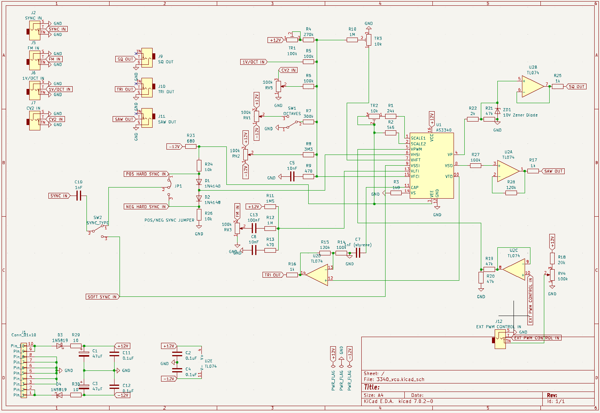
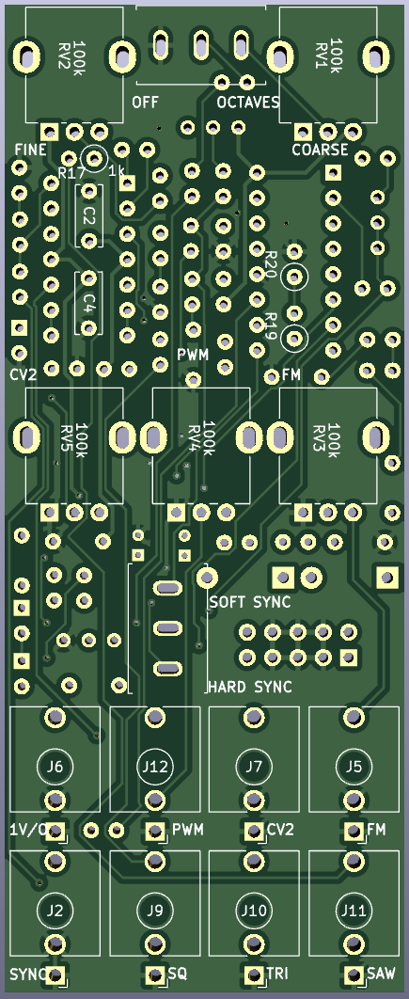
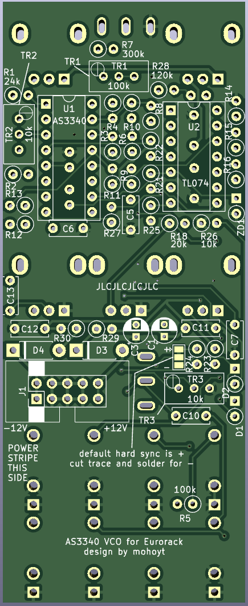

# AS3340 Voltage Controlled Oscillator
A Eurorack VCO powered by AS3340

## Features
* 40mm x 99mm single PCB design (so very cheap to manufacture)
* Lots of standing resistors and diodes to help achieve this (so it's a super crowded PCB)
* See BOM info [here](bom/ibom.html)

## Inputs
* 1v/Oct In
* CV2 In
* FM In
* Sync In (selectable between hard and soft sync with switch and settable between positive hard sync (default) and negative hard sync with a jumper)
* PWM Control In

## Outputs
* Sawtooth
* Square
* Triangle

## Influences
* [Digisound 80 VCO](http://www.digisound80.co.uk/digisound/modules/80-2_files/80-2.pdf)
* [Eddy Bergman's 3340 VCO](https://www.eddybergman.com/2020/01/synthesizer-build-part-18-really-good.html)
* [AI Synthesis' VCO](https://aisynthesis.com/product/ai011-voltage-controlled-oscillator/)

## Status
* First batch of PCBs arrived and 1 built. Working and tunable. 
* Lots of standing resistors to maximise soldering challenges
* 3d printed panel designed and will be tested soon
* Use this design at your own risk

## Build notes
* Pay close attention to the iBOM to get the right positioning
* Make sure you do the components under the ICs before you solder the IC sockets
* Start with the shorter components and work your way up (I started with resistors and diodes)
* Do panel components last (and ideally mount on panel before soldering to get best alignment)
* The digisound guide was helpful in tuning. Focus on getting the relationship between 1v/octave at lowish freqs with trimmer 2 while octave switch is off. Then use trimmer 1 to tune with keyboard with the fine tune pot in the middle position. Trimmer 3 can be used to adjust linearity at high freqs. 

## Known Issues
[] Some resistor values need updating in BOM
[] Holes for toggle switches are slightly too close tigether so legs will need bent to fit until footprint is updated. 
[] Footprint for poly timing cap could be much bigger

